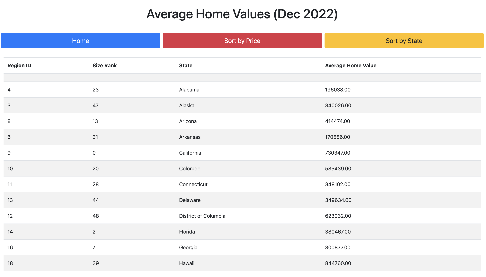

# Home Value Data Sorter

## Table of Contents
* [Description](#Description)
* [Installation](#installation)
* [Tech](#Tech)
* [Questions](#questions)

## Description
This is a full-stack web application that uses the MVC paradigm that lets users sort data by state or price in a table format. 

## Installation
This application requires the user to have `node.js` and `MySQL` installed.
* the user should fork or clone the repository from Github and install the dependancies by typing in `npm i` in the root directory
* create a .env file with this information, in this order:

    DB_NAME = homevalue_db;

    DB_USER=

    DB_PASSWORD=

* log into mysql in the integrated terminal by typing in `mysql -u <username> -p`. 
* type `SOURCE db/schema.sql;` and then exit.
* Run `npm start` and go to your local browser and type in  localhost:3001 in the URL.

If you receive an error on MySQL stating "loading local data is disabled", do the following steps:
1. set the global variables by using this command: mysql> `SET GLOBAL local_infile=true;`
2. quit current server: mysql> `quit`
3. connect to the server with local-infile system variable :
`mysql --local-infile=true -u root -p`

This should now allow you to load local data into you mySQL database.

## Tech
* HTML
* Javascript
* Handlebars
* Node.js
* Express.js
* MySQL
* dotenv
* sequelize
* Bootstrap

## Questions
If you have any questions about this projects, please contact me directly at davidpascual200@gmail.com.

